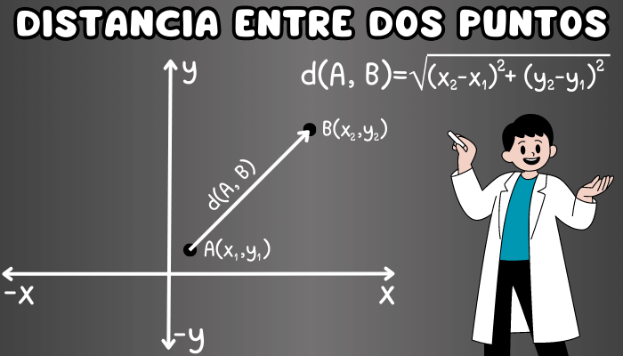

## Prueba Ciudades mas cercas

Se desea averiguar mediante una lista de ciudades. Cuales son las ciudades mas cercanas a una que se seleccione.


### Resolucion de problema 
Para abordar el problema de las ciudades se utilizo el metodo de pitagoras 



## Tecnologias
  - Typescript (nodeJS)
  - React
  ### Herramientas
  - Material UI (Libreria grafica)
  - Jest (Libreria de Pruebas Unitarias)
  - testing-library (Testing Integracion)


## Correr Proyecto

  ```
  pnpm install
  pnpm dev
  ```

## Correr Test
Antes de correr los test para correr 
```
pnpm test
```